### **核心方案是把“直接缩小图片”改成“人像理解 → 区域分割 → 调色板受限量化 → 轮廓保护 → 拼豆可行性修正 → 网格图纸渲染”的完整流水线。**

你期望的是第一张图：轮廓清楚、五官完整、发丝和衣服分区明确；当前第二张则是典型的低分辨率直接采样结果，存在五官错位、肤色噪点、边缘破碎和大面积黑块。下面按可独立测试的模块设计。

### **一、目标效果与验收指标**

系统不要追求普通照片意义上的“像素还原”，而应追求适合拼豆的“符号化还原”。优先级应为：

1. 人脸结构和身份特征；
2. 眼睛、眉毛、鼻子、嘴巴的位置与形状；
3. 头发、皮肤、衣服等大区域边界；
4. 局部明暗与装饰细节；
5. 原始像素色彩的精确还原。

建议设置以下可自动测试的指标：

| 指标 | 建议目标 | 用途 |
|---|---:|---|
| 人脸关键点偏差 | 小于画布短边的 3% | 防止五官错位 |
| 连通域最小面积 | 2～4 颗豆 | 抑制孤立噪点 |
| 轮廓保留率 | 大于 85% | 保住脸型、头发和服装边缘 |
| 调色板外颜色数 | 0 | 保证颜色可购买、可拼 |
| 单颗孤立颜色比例 | 小于 2% | 避免“椒盐噪声” |
| 最大颜色数 | 24～48 色 | 控制制作难度 |

### **二、推荐系统架构**

```mermaid
flowchart LR
    A[图片输入] --> B[输入规范化]
    B --> C[人物检测与智能裁剪]
    C --> D[语义分割与关键点检测]
    D --> E[风格化预处理]
    E --> F[语义感知缩放]
    F --> G[拼豆调色板量化]
    G --> H[轮廓与五官保护]
    H --> I[拓扑和可拼性修正]
    I --> J[质量评分与局部迭代]
    J --> K[图纸渲染]
    K --> L[颜色清单与用量统计]
```



每个模块只接受明确数据结构并返回新结果，不直接修改其他模块状态。这样可以单独替换算法、编写单元测试和做 A/B 对比。

---

### **三、模块拆分**

#### **1. 输入规范化模块 `InputNormalizer`**

负责 EXIF 旋转、透明背景合成、色彩空间统一、降噪和尺寸限制，不执行像素化。

输入：

```text
原始图片、背景颜色、最大处理边长
```

输出：

```text
线性 RGB 图、sRGB 预览图、原图元数据
```

建议先做轻度双边滤波，去除皮肤和背景中的细碎噪声，同时避免普通高斯模糊破坏眼睛及发际线。

```pseudo
function normalize(image, config):
    image = applyExifOrientation(image)
    image = compositeAlpha(image, config.backgroundColor)
    image = convertICCProfile(image, "sRGB")
    linearImage = srgbToLinear(image)

    if maxDimension(linearImage) > config.maxDimension:
        linearImage = resizeLanczos(
            linearImage,
            fitWithin(config.maxDimension)
        )

    denoised = bilateralFilter(
        linearImage,
        spatialSigma = config.spatialSigma,
        colorSigma = config.colorSigma
    )

    return NormalizedImage(
        linearRgb = denoised,
        previewSrgb = linearToSrgb(denoised),
        metadata = readMetadata(image)
    )
```

#### **2. 人物检测与构图模块 `PortraitComposer`**

当前图像的问题之一，很可能是整幅图片直接压到固定网格，导致脸部占用豆数不足。这个模块先定位人脸和人物，再按照输出模板智能裁剪。

针对头像图，建议让人脸宽度占画布宽度的 45%～65%，双眼区域至少占 8～12 个网格。若眼睛缩小后不足 2×2 格，再好的量化也无法保留神态。

```pseudo
function composePortrait(image, gridSize, mode):
    faces = faceDetector.detect(image)
    personMask = personSegmenter.segment(image)

    if faces.isEmpty():
        crop = saliencyBasedCrop(image, personMask, gridSize.aspectRatio)
        return crop, CompositionMetadata(faceFound = false)

    face = selectPrimaryFace(faces)
    landmarks = landmarkDetector.detect(image, face.box)

    targetFaceRatio =
        mode == "headshot" ? 0.58 :
        mode == "halfBody" ? 0.42 : 0.30

    cropBox = buildCropAroundFace(
        imageSize = image.size,
        faceBox = face.box,
        personMask = personMask,
        targetAspectRatio = gridSize.aspectRatio,
        targetFaceWidthRatio = targetFaceRatio,
        headTopMargin = 0.08,
        chinBottomMargin = mode == "headshot" ? 0.18 : 0.45
    )

    cropBox = clampToImage(cropBox, image.size)
    crop = cropAndPad(image, cropBox, background = transparent)

    transformedLandmarks = transformPoints(landmarks, cropBox, crop.size)

    return crop, CompositionMetadata(
        faceFound = true,
        faceBox = transformBox(face.box, cropBox),
        landmarks = transformedLandmarks,
        personMask = transformMask(personMask, cropBox)
    )
```

#### **3. 语义分析模块 `SemanticAnalyzer`**

至少输出以下区域：

- 背景；
- 皮肤；
- 头发；
- 左右眼、眉毛；
- 鼻子；
- 嘴唇；
- 服装；
- 配饰。

不要让所有区域使用同一套量化规则。皮肤需要平滑，眼睛需要高对比，头发需要保留外轮廓，衣服允许更大色块。

```pseudo
function analyzeSemantics(image, composition):
    parsing = portraitParser.predict(image)
    landmarks = composition.landmarks

    masks = {
        background: parsing.background,
        skin: parsing.face + parsing.neck + parsing.ears,
        hair: parsing.hair,
        eyes: parsing.leftEye + parsing.rightEye,
        eyebrows: parsing.eyebrows,
        nose: buildNoseRegion(landmarks),
        mouth: parsing.upperLip + parsing.lowerLip,
        clothes: parsing.clothes,
        accessories: parsing.accessories
    }

    masks = resolveOverlapsByPriority(
        masks,
        priority = [
            eyes, mouth, eyebrows, accessories,
            hair, skin, clothes, background
        ]
    )

    edgeMap = combineEdges(
        canny(image),
        boundaries(masks),
        landmarkFeatureEdges(landmarks)
    )

    importanceMap = weightedSum({
        edgeMap: 0.35,
        gaussianAround(landmarks.eyes): 0.25,
        gaussianAround(landmarks.mouth): 0.15,
        boundaries(masks): 0.20,
        saliency(image): 0.05
    })

    return SemanticData(masks, edgeMap, importanceMap, landmarks)
```

#### **4. 风格化预处理模块 `Stylizer`**

第一张参考效果并不是照片直接像素化，而是经过插画化处理：肤色更统一、眼睛更大更清晰、发块边界明确、衣服阴影被归并。

如果网站面向普通用户，建议提供两条处理路径：

- **写实拼豆模式**：保持真实比例，只整理色块；
- **Q 版插画模式**：使用图生图或肖像风格化模型先转成统一卡通风格，再生成图纸。

关键原则是：生成模型只负责形成中间插画，最终拼豆颜色、网格和统计必须由确定性算法完成。

```pseudo
function stylize(image, semantic, mode):
    if mode == "realistic":
        result = edgePreservingSmooth(image)
        result = localContrast(result, semantic.masks.eyes, amount = 1.3)
        result = flattenRegion(result, semantic.masks.skin, strength = 0.55)
        result = flattenRegion(result, semantic.masks.clothes, strength = 0.35)
        return result

    if mode == "chibi":
        guide = {
            pose: semantic.landmarks,
            segmentation: semantic.masks,
            edges: semantic.edgeMap
        }

        generated = imageToImageModel.generate(
            source = image,
            guides = guide,
            denoiseStrength = 0.35,
            prompt = "clean chibi portrait, clear eyes, flat color blocks",
            identityStrength = 0.8
        )

        return alignGeneratedFaceToSource(
            generated,
            sourceLandmarks = semantic.landmarks
        )
```

生成模型强度不宜过高，否则会改变人物身份、发型和衣服。建议保留原图与风格化结果的滑杆，并在人脸相似度低于阈值时回退至写实模式。

#### **5. 语义感知缩放模块 `SemanticDownsampler`**

这是核心模块。不能只调用一次普通 `resize(width, height)`。每个目标网格单元应综合：

- 区域占比；
- 中位颜色；
- 边缘方向；
- 语义优先级；
- 人脸特征占比；
- 邻域一致性。

若一个网格同时覆盖眼白、虹膜和头发，普通平均会产生灰褐色；语义采样应优先选择该格中最重要且占比足够的区域。

```pseudo
function semanticDownsample(image, semantic, gridWidth, gridHeight):
    cells = createGrid(image.size, gridWidth, gridHeight)
    output = Matrix(gridHeight, gridWidth)

    for cell in cells:
        pixels = image.pixelsInside(cell.highResolutionBounds)
        labels = semantic.masks.labelsInside(cell.highResolutionBounds)
        importance = semantic.importanceMap.inside(cell.highResolutionBounds)

        coverage = histogram(labels)

        dominantLabel = chooseLabel(
            coverage,
            priority = {
                eye: 10,
                mouth: 9,
                eyebrow: 8,
                accessory: 7,
                hair: 6,
                skin: 5,
                clothes: 4,
                background: 1
            },
            minimumCoverage = {
                eye: 0.12,
                mouth: 0.15,
                eyebrow: 0.18,
                default: 0.35
            }
        )

        candidates = pixels.where(label == dominantLabel)

        if candidates.isEmpty():
            candidates = pixels

        color = weightedMedoidColor(
            candidates,
            weights = importance,
            colorSpace = "OKLab"
        )

        output[cell.y][cell.x] = GridPixel(
            sourceColor = color,
            semanticLabel = dominantLabel,
            importance = mean(importance),
            edgeDirection = dominantEdgeDirection(cell, semantic.edgeMap)
        )

    return output
```

`weightedMedoidColor` 比平均色更适合拼豆，因为它会选取区域中真实存在的代表颜色，避免平均后出现调色板中不存在的脏色。

#### **6. 拼豆调色板模块 `PaletteQuantizer`**

必须使用真实品牌色卡，而非任意 RGB 聚类。每个色号应记录：

```text
品牌、系列、色号、名称、sRGB、Lab/OKLab、库存、是否透明、是否夜光
```

色差计算建议使用 OKLab 或 CIEDE2000，避免直接使用 RGB 欧氏距离。皮肤、头发、眼睛可使用不同候选子色板。

```pseudo
function quantizeGrid(grid, palette, semantics, config):
    usablePalette = palette.filter(
        inStock = true,
        series in config.allowedSeries,
        colorId not in config.disabledColors
    )

    regionPalettes = buildRegionPalettes(
        usablePalette,
        maxColors = {
            skin: config.skinColorLimit,
            hair: config.hairColorLimit,
            clothes: config.clothesColorLimit,
            background: config.backgroundColorLimit
        }
    )

    result = clone(grid)

    for pixel in result:
        candidates = regionPalettes[pixel.semanticLabel]

        best = argmin(candidates, beadColor ->
            colorDistanceOKLab(pixel.sourceColor, beadColor.oklab)
            + huePenalty(pixel.sourceColor, beadColor)
            + regionPenalty(pixel.semanticLabel, beadColor)
            + rareColorPenalty(beadColor, result, config)
        )

        pixel.beadColor = best

    return optimizeGlobalPalette(result, config.maxTotalColors)
```

全局颜色压缩不能简单删除使用数量少的颜色。眼白、嘴唇高光、瞳孔高光即使只出现几颗，也可能非常重要。应按“使用数量 × 语义权重 × 色差不可替代性”计算保留价值。

```pseudo
function optimizeGlobalPalette(grid, maxColors):
    while uniqueColors(grid).count > maxColors:
        colors = uniqueColors(grid)

        removable = argmin(colors, color ->
            usageCount(color) *
            meanSemanticImportance(color) *
            nearestAlternativeDistance(color)
        )

        alternative = bestCompatibleAlternative(
            removable,
            excluding = protectedFeatureColors()
        )

        replaceColor(grid, removable, alternative)

    return grid
```

#### **7. 五官和轮廓保护模块 `FeatureProtector`**

缩放后需要重建最低可读结构。例如：

- 每只眼睛至少包含深色虹膜、瞳孔或高光中的两层；
- 嘴巴至少形成连续曲线，不能变成随机红点；
- 鼻子只用少量阴影，不应画成黑线；
- 发际线与脸部必须连续分离；
- 眼镜应保持左右镜框大致对称。

```pseudo
function protectFeatures(grid, semantic, config):
    gridLandmarks = mapLandmarksToGrid(semantic.landmarks, grid.size)

    protectEye(grid, gridLandmarks.leftEye, semantic)
    protectEye(grid, gridLandmarks.rightEye, semantic)
    protectMouth(grid, gridLandmarks.mouth, semantic)
    protectEyebrows(grid, gridLandmarks.eyebrows)
    protectFaceContour(grid, semantic.masks.skin, semantic.masks.hair)

    return grid


function protectEye(grid, eyePoints, semantic):
    region = polygonToGridRegion(eyePoints).expand(1)

    if region.width < 3 or region.height < 2:
        markQualityWarning("输出网格不足以表现眼睛")
        return

    dark = darkestAllowedColor(region.semanticContext)
    light = lightestAllowedColor(region.semanticContext)
    iris = chooseIrisColor(region.sourceColors)

    shape = rasterizeCanonicalEye(
        bounds = region.bounds,
        orientation = estimateEyeOrientation(eyePoints)
    )

    applyPattern(grid, shape.sclera, light)
    applyPattern(grid, shape.iris, iris)
    applyPattern(grid, shape.pupil, dark)

    if region.width >= 4 and region.height >= 3:
        applyPattern(grid, shape.highlight, light)
```

这里不能无限“自动美化”。任何修正都要受原始关键点和语义区域约束，并提供关闭选项。

#### **8. 拓扑与可拼性修正模块 `BeadabilityOptimizer`**

当前效果中的大量孤立色块，需要通过离散优化清理。每颗豆的颜色选择应同时考虑原图色差、邻域连续性、轮廓和区域边界。

可定义能量函数：

$$
E = \sum_p D(p,c_p)
+ \lambda_s \sum_{(p,q)} S(c_p,c_q)
+ \lambda_e \sum_p B(p,c_p)
+ \lambda_r \sum_k R(C_k)
$$

其中：

- $D$ 是原始颜色与豆色的色差；
- $S$ 是邻域平滑代价；
- $B$ 是破坏重要边缘的惩罚；
- $R$ 是孤立连通域与不可拼细节的惩罚。

```pseudo
function optimizeBeadability(grid, semantic, config):
    repeat config.maxIterations times:
        changed = false

        components = findConnectedComponentsByColor(grid)

        for component in components:
            minSize = minimumComponentSize(
                semanticLabel = majorityLabel(component),
                importance = meanImportance(component)
            )

            if component.size < minSize and not isProtected(component):
                replacement = chooseReplacementColor(
                    component,
                    neighborColors = boundaryColors(component),
                    objective = colorError
                              + config.smoothnessWeight * boundaryDisagreement
                              + config.edgeWeight * importantEdgeDamage
                )

                recolor(component, replacement)
                changed = true

        grid = majorityFilterWithinSemanticRegions(
            grid,
            radius = 1,
            protectedMask = semantic.importantFeatures
        )

        grid = repairOneCellHoles(grid)
        grid = smoothStairStepContours(grid, semantic.edgeMap)

        if not changed:
            break

    return grid
```

多数滤波只能在同一语义区域内部运行，不能跨过发际线、脸部边界或衣领，否则会把人物结构抹掉。

#### **9. 自动质量评估模块 `QualityEvaluator`**

输出前自动检测“这张图是否值得交付”，而不是只保证程序不报错。

```pseudo
function evaluateQuality(grid, source, semantic):
    rendered = renderWithoutGrid(grid)

    score = {}

    score.faceStructure = landmarkSimilarity(
        detectLandmarks(rendered),
        mapLandmarksToRendered(semantic.landmarks)
    )

    score.edgeRetention = compareImportantEdges(
        rendered,
        semantic.edgeMap
    )

    score.colorAccuracy = weightedColorSimilarity(
        rendered,
        source,
        semantic.importanceMap
    )

    score.noise = 1 - isolatedCellRatio(grid)
    score.paletteCompliance = paletteCompliance(grid)
    score.featureReadability = evaluateEyesMouthHair(grid, semantic)

    score.total = weightedAverage({
        faceStructure: 0.30,
        featureReadability: 0.25,
        edgeRetention: 0.20,
        colorAccuracy: 0.10,
        noise: 0.10,
        paletteCompliance: 0.05
    })

    return score
```

分数不足时，可自动尝试：

1. 扩大人脸裁剪；
2. 提高网格尺寸；
3. 降低皮肤颜色数量；
4. 增加五官保护权重；
5. 降低平滑强度；
6. 回退至上一步结果。

```pseudo
function generateBestPattern(request):
    candidates = []

    for preset in buildCandidatePresets(request):
        result = pipeline.run(request.image, preset)
        quality = evaluator.evaluate(result)
        candidates.append({ result, quality, preset })

    best = maxBy(candidates, item -> item.quality.total)

    if best.quality.featureReadability < request.minimumReadability:
        best.warnings.add(
            "当前网格不足以保留人物五官，建议增加宽度或改用头像裁剪"
        )

    return best
```

---

### **四、完整核心流程伪代码**

```pseudo
class BeadPatternPipeline:
    constructor(
        normalizer,
        composer,
        analyzer,
        stylizer,
        downsampler,
        quantizer,
        featureProtector,
        beadabilityOptimizer,
        evaluator,
        renderer
    ):
        saveDependencies()

    function run(request):
        normalized = normalizer.normalize(
            request.image,
            request.normalizeConfig
        )

        portrait, composition = composer.composePortrait(
            normalized.linearRgb,
            request.gridSize,
            request.compositionMode
        )

        sourceSemantic = analyzer.analyzeSemantics(
            portrait,
            composition
        )

        styled = stylizer.stylize(
            portrait,
            sourceSemantic,
            request.styleMode
        )

        styledSemantic = analyzer.reuseOrRefine(
            sourceSemantic,
            styled
        )

        grid = downsampler.semanticDownsample(
            styled,
            styledSemantic,
            request.gridSize.width,
            request.gridSize.height
        )

        grid = quantizer.quantizeGrid(
            grid,
            request.brandPalette,
            styledSemantic,
            request.paletteConfig
        )

        grid = featureProtector.protectFeatures(
            grid,
            styledSemantic,
            request.featureConfig
        )

        grid = beadabilityOptimizer.optimizeBeadability(
            grid,
            styledSemantic,
            request.optimizationConfig
        )

        grid = quantizer.revalidateColors(
            grid,
            request.brandPalette
        )

        quality = evaluator.evaluateQuality(
            grid,
            styled,
            styledSemantic
        )

        artifacts = renderer.render(
            grid,
            options = {
                showGrid: true,
                showSymbols: request.showSymbols,
                showColorCodes: request.showColorCodes,
                pageSize: request.pageSize
            }
        )

        return PatternResult(
            grid = grid,
            preview = artifacts.preview,
            sheets = artifacts.sheets,
            colorStatistics = countColors(grid),
            quality = quality,
            warnings = collectWarnings()
        )
```

---

### **五、模块接口建议**

建议使用以下中间结构，避免模块间传递模糊的图片对象：

```pseudo
type GridPixel = {
    x: Integer
    y: Integer
    sourceColor: OKLab
    beadColor: PaletteColor | null
    semanticLabel: SemanticLabel
    importance: Float
    edgeDirection: Float | null
    protected: Boolean
}

type PaletteColor = {
    brand: String
    series: String
    code: String
    name: String
    srgb: RGB
    oklab: OKLab
    stockAvailable: Boolean
}

type PatternResult = {
    grid: Matrix<GridPixel>
    preview: Image
    sheets: List<RenderedPage>
    colorStatistics: Map<ColorCode, Integer>
    quality: QualityScore
    warnings: List<String>
}
```

---

### **六、测试方案**

#### **单元测试**

| 模块 | 重点测试 |
|---|---|
| 输入规范化 | EXIF 旋转、透明图、不同 ICC 配置 |
| 构图 | 单人、多人、侧脸、无脸、人物被截断 |
| 语义分析 | 头发与背景、眼镜、耳饰、手遮脸 |
| 缩放 | 混合语义单元、边界单元、极小五官 |
| 色彩量化 | 色卡限制、缺货色、最大色数 |
| 特征保护 | 小眼睛、闭眼、侧脸、不对称表情 |
| 可拼性优化 | 孤点、小孔、断线、锯齿边 |
| 渲染 | 坐标、分页、色号、豆数统计 |

#### **黄金样本回归测试**

建立 50～200 张不同人像的固定数据集，每次算法升级都比较：

- 最终网格是否发生变化；
- 关键点相似度是否下降；
- 孤立像素是否增加；
- 颜色数是否超限；
- 人工评分是否改善。

不要只保存最终 PNG，还应保存 `GridPixel[][]`，这样测试不受抗锯齿、字体和渲染器变化影响。

```pseudo
test "eyes remain readable at 64x80":
    result = pipeline.run(goldenPortrait, preset64x80)

    assert result.quality.featureReadability >= 0.80
    assert countColors(result.grid) <= 36
    assert isolatedCellRatio(result.grid) <= 0.02
    assert containsContinuousDarkRegion(result.grid, LEFT_EYE)
    assert containsContinuousDarkRegion(result.grid, RIGHT_EYE)
```

#### **视觉差异测试**

```pseudo
test "pattern rendering matches approved baseline":
    result = renderer.render(approvedGrid)
    diff = perceptualImageDiff(
        result.preview,
        loadBaseline("portrait-01.png")
    )

    assert diff.changedPixelRatio < 0.005
```

---

### **七、前端应提供的控制项**

不建议把大量算法参数直接暴露给普通用户。前端保留少量有意义的控制：

| 控件 | 推荐选项 |
|---|---|
| 构图 | 头像、半身、全身 |
| 风格 | 写实、柔化插画、Q 版 |
| 网格尺寸 | 48、64、80、100 颗宽 |
| 细节等级 | 简洁、标准、精细 |
| 最大颜色数 | 16、24、36、48 |
| 色卡品牌 | 根据实际支持品牌 |
| 背景 | 保留、纯色、透明/不拼 |
| 五官增强 | 关闭、自然、明显 |
| 平滑程度 | 低、中、高 |

预览页应同时显示原图、风格化中间图、无网格成品和带网格图纸。这样用户能判断问题究竟来自风格转换、降采样还是色卡映射。

---

### **八、推荐落地顺序**

第一阶段先不引入生成模型，优先实现智能裁剪、肖像分割、OKLab 色卡量化、孤点清理和五官保护。这几项就能显著改善当前的大色块、噪点和五官损坏问题。

第二阶段增加语义感知降采样和自动质量评分，使不同照片能够稳定输出。

第三阶段再接入可选的 Q 版风格化模型，目标是接近参考图的统一插画效果。模型输出必须经过身份相似度检测，并允许回退。

第四阶段加入用户局部编辑器：锁定颜色、画笔、橡皮、区域换色、左右对称修正，以及重新统计豆数。自动算法很难覆盖所有审美选择，最终编辑能力会直接决定网站的可用性。

最需要避免的实现是：

```pseudo
small = resize(original, gridWidth, gridHeight)
pattern = nearestPaletteColorForEveryPixel(small)
```

这正是当前第二张图容易出现的结果。真正决定质量的并不是最后的网格线，而是缩小前对人物结构、语义区域和重要特征进行了多少保护。

*内容由 AI 生成仅供参考*